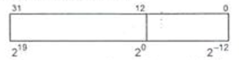

## Display Frac

In assembly program there was defined a special 32 bit format for fixed point numbers without sign defined as follows.

Write subroutine in x86 masm which will display this number in decimal form with 2 decimal places after dot. We assume that given number will be passed via EAX and displaying itself is realized via MessageBox function

Tip: 
Multiply given number by 100, remove fraction part and insert the dot.