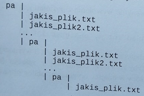

## Find file

Write subroutine in x86 masm prepared to be called from C language with the following prototype:

```c
bool find_file(char * root_path, char * file_name);
```

Subroutine should traverse directory tree in search for file with name given in `file_name` array, starting from `root_path`. Every name is expressed as array in ASCIIZ. Directory tree is expressed as follows:


`pa` directory has always the same name. Traversing should end when file was found with return value of 1 or in case of not finding next `pa` directory which should result in return 0.

For directory change there's a WinAPI function with prototype:

```c
BOOL SetCurrentDirectory(char * lpPathName)
```

called by _SetCurrentDirectory@4. Function takes full path in directory in which program should set context. Checking for file in current directory is being done with 
```c
DWORD FindFirstFileA(char * lpPathName, LPWIN32_FIND_DATAA lpFindFileData).
```

`lpPathName` is relative path of file being searched for in given context,

`LPWIN32_FIND_DATAA` is 56-byte buffer being filled in case of finding a file.

`FindFirstFileA` returns -1 in case of not finding file in given context, otherwise it returns non-zero value.