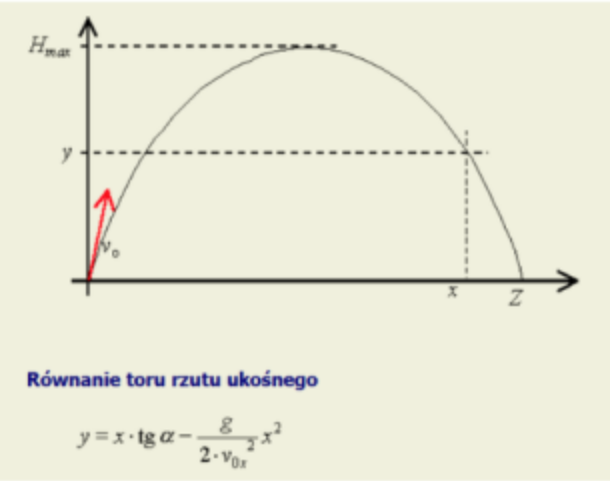

## Find height

Write subroutine in x86 masm prepared to be called from C language with the following prototype:

```c
float find_height(float x,float alpha, float v_horizontal);
```
Which is calculating height for given body thrown at `alpha` angle with speed `v`. 



Equation needed to perform this task is presented as follows:

$
y = x * tg\alpha - \frac{g}{2 * (v_0)^2} * x^2
$