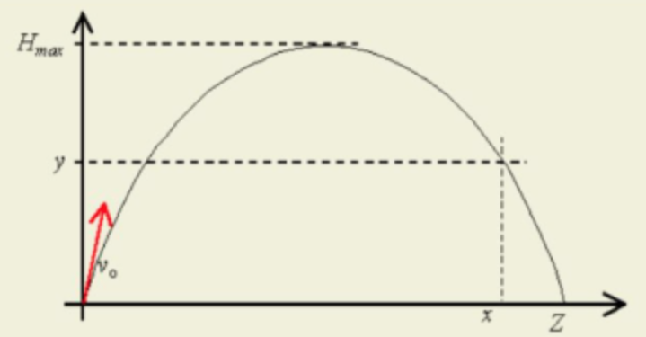

## Find max range

Implement in x86 masm a subroutine adjusted to be called from C language. It should match the following prototype:

```c
float find_max_range(float v, float alpha);
```

Which is meant to calculate maximum distance Z on which given body thrown at angle (in radians) `alpha`, with speed `v` and earth acceleration `g` with 2 decimal places precision. 



The equation needed to solve this is presented as follows:

$
Z = \frac{2(v_{0})^2 * sin\alpha * cos\alpha}{g} = \frac{(v_{0})^2}{g} sin2\alpha
$

Tip:

To calculate values of sin/cos you can use `fsincos` instruction. It takes angle in radians on stack of x87 coprocessor. Value of sin is placed in st(1), cos in st(0)