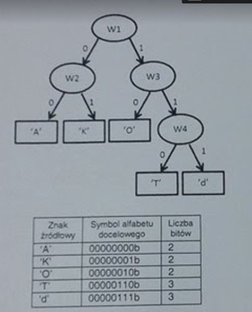

## Huffman

Huffman compression is widely used in computer science.
It's all about assigning to characters occuring in the alphabet a special symbols (desired alphabet). Complexity of compression is in the variable length of symbols in the desired alphabet. Length (measured in bits) depends on the number of occurences in the text being compressed. Based on that we build a special binary tree (degree of each node/vertex is equal to 0 or 2, see example image below), which depicts how to encode each letter (the more occurencies for letter, the shorter the symbol length will be). Calculated tree is being transformed to given below `encoding array`. This table consists of 3 columns:  `source letter`, `target symbol`, `number of bits for target symbol`. Compression is being done via replacing source letter with target symbol and merging bits. 



Attention:
1. Assume there are defined 2 global variables in static data segment:
```x86asm
tablica_kodowa dd ?
liczba_wierszy dd 0
```
Which contain address for already allocated data buffer for `encoding array` and actual number of rows in this array

2. Tree can hold from 2 to 256 input characters. Assume that depth of tree won't exceed 8 levels.

Tasks:

1. Write subroutine in x86 masm prepared to be called from C language with assuming the following prototype:

```c
void wypelnijTabliceKodowa(struct node * wezel);
```

Function is meant to fill the `encoding array` for a regular binary tree of which root is passed as an argument. `node` structure is describing a single node/vertex in a tree. It consists of 2 pointers on left node and right node. If node is a leaf, the these pointers are equal to -1. The value of `znak` field is equal to the output target symbol.

```c
struct node {
  struct node * left;
  struct node * right;
  char znak;
}
```

For each character in tree there must be a corresponding row in the `encoding array`. As mentioned earlier: Each row contains 3 elements put next to another: 1-byte input character, 1-byte output symbol, 1-byte number representing number of bits for output.

2. Write subroutine in x86 masm with the following prototype:

```c
unsigned int kompresuj(unsigned char * wejscie, unsigned int dlugosc, unsigned char * wyjscie);
```

The purpose of this function is to substitute the set of bytes pointed by `wejscie` of number of bytes in `dlugosc`. Compression should replace every character with according to the `encoding array` output symbol.
Output bit sequence should be put at buffer pointed by `wyjscie` completed by zero bits to the multiplier of 8.

For example for input "AKO" the output should be 00000110b. Function returns the number of encoded string in bits (6 for this example)
