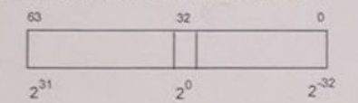

## float2miesz

In computer program in C language there is defined a special 64bit type `MIESZ` for encoding
fixed point numbers without sign. Integral and fractional parts are placed as shown on the image below:


<br>
Write subroutine prepared to be called from C language with matching the following prototype:

```c
MIESZ float2miesz(float q);
```

Which is going to take number in float and return its MIESZ value.