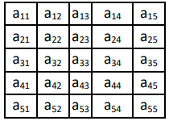
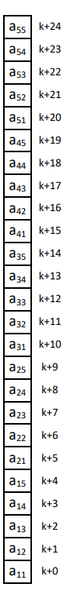
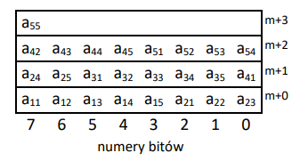

## Reduce Matrix

Some computer program is using square array given below:

Each array element takes 1 byte and may contain only either value of 1 or 0.
Examplary representation of such 5x5 array in the memory is presented below (Little Endian):

Write fragment of x86 program which is going to perform compression of 70x70 array to reduce each byte to bit (Image below). Assume that address of input array resides in `ESI` register while address of output array resides in `EDI`.

