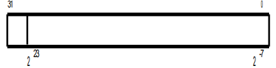

## Round

In program there is defined format for encoding mixed numbers

Assuming the number in given format resides in `EDX` register, write a fragment of program which is going to round this number to closes integral number. Result should be returned via the same input register.

Tip: Check state of 2-1 bit

