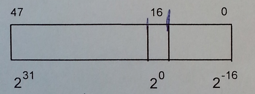

## uint48_float

In some program made in C language there was defined 48-bit type UINT48 which encodes fixed point numbers without sign as shown on the image below:



Write subroutine in x86 masm which is going to convert number p in UINT48 to float format. Assume the following signature on the level of C language:

```c
float uint48_float(UINT48 p);
```

Tips:
  1. Parameter p is bassed by stack in form of 8 bytes where 2 oldest are not used.
  2. You can skip the case o 0 number