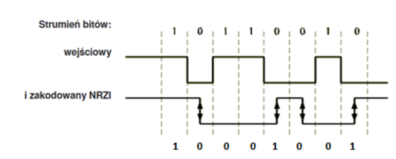

## USB

In USB protocol, for serial transmission of data there is used NRZI encoding method (Non Return to Zero Inverted).

In 2 level NRZI signal switching level of signal is happening synchronounsly according to the clock signal if transmitted bit has value of 0, if this bit has value of 1 then value of physical signal does not change.

Decoding the signal is the reverse operation for encoding.




Write subroutine in x86 masm which is going to decode data written in some memory buffer representing already encoded signal NRZI. This memory buffer is declared as:

```x86asm
bufor dq 256 dup (?)
```

Starting bit of encoded signal is the oldest bit of the first buffer byte.
Value of first bit is as decoded has to be equal to the encoded.
Next decoded values are meant to be stored next to buffer without the need of allocation.