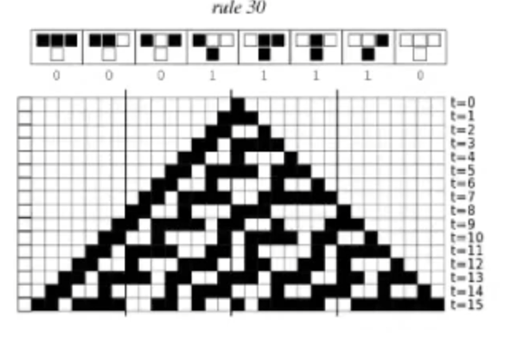

## Wolfram

Write fragment of x86 assembly code which is going to work as a simple Wolfram's cellular automata in rule 30



Program is changing bits of next 4-byte rows according to state of bits in previous row. Assume that there are 2 buffers allocated in static memory:

```x86asm
starting_row db 0h, 0h, 80h, 0h
next_rows db 15*4 dup(?)
```

Your code should fill `next_rows` with valid values.
