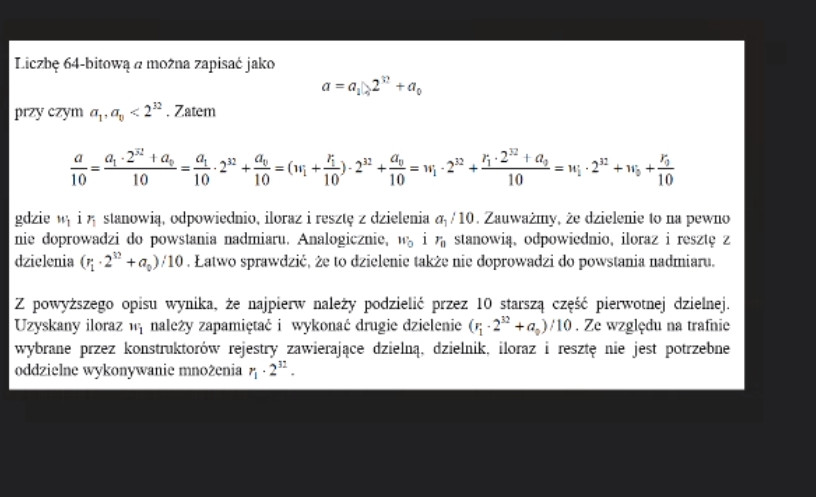

## write64

Write subroutine in x86 masm which is going to take 64bit number located in
[edx]:[eax] registers (edx is more significant part) and display it to the user.
Using x64 registers or SSE instructions is forbidden.

Your solution should contain example call of your subroutine.

Hint:
 
