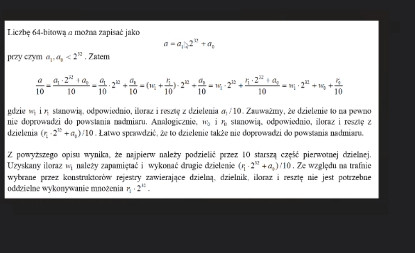

## write 96

Write x86 masm subroutine which is going to take 96bit number located in 

edx:ebx:eax registers

where edx is the most significant and eax is most less significant part.

Using x64 registers or SSE instructions is forbidden.
Your solution should contain example call of your subroutine.

Hint:
 

You can use 79228162514264337593543950335 to test your subroutine